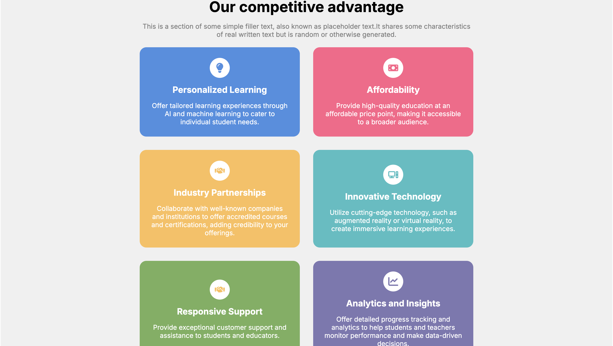
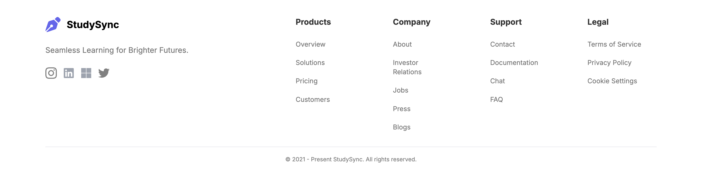

📚 Study-Sync

StudySync is a simple educational website built using HTML and CSS. It provides a visually appealing and responsive design for users to explore educational content.

🚀 Features

🎨 Modern UI – Clean and visually appealing interface.

📲 Responsive Design – Accessible on all devices.

🔗 Navigation Menu – Home, Features, Pricing, Blog, and About sections.

📧 Newsletter Signup – Stay updated with the latest content.

🛠️ Tech Stack

HTML – Structure of the website.

CSS – Styling & layout design.

📥 Installation & Usage

To run StudySync on your local machine, follow these steps:
Clone the repository
git clone https://github.com/Krishrajput1107/studysync.git

Navigate to the project directory
cd studysync

Open the index.html file in your browser
start index.html  # Windows
open index.html   # macOS/Linux

## 📸 Screenshots

### 🔹 Home Page

### 🔹 Features Section

### 🔹 Contact Page

### 🔹 Footer

🔮 Future Enhancements

🖥️ Backend Integration – Implement a backend using Node.js & Express.js.

🗃️ Database Support – Store user data with MongoDB or Firebase.

📝 User Authentication – Add login and signup functionality.

📊 Quiz System – Enable interactive quizzes with score tracking.

🎥 Dynamic Video Streaming – Integrate backend support for video content.

🤝 Contributors

Krish Rajput (@Krishrajput1107)

📌 Feel free to contribute and enhance StudySync! 🚀

